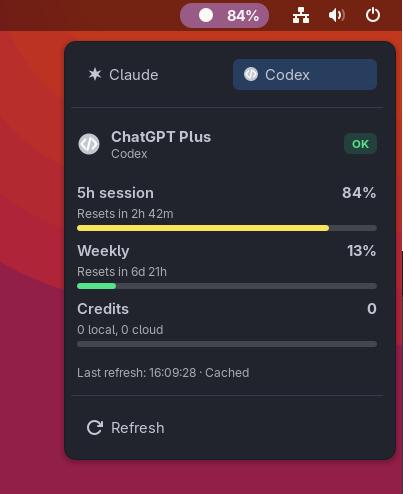
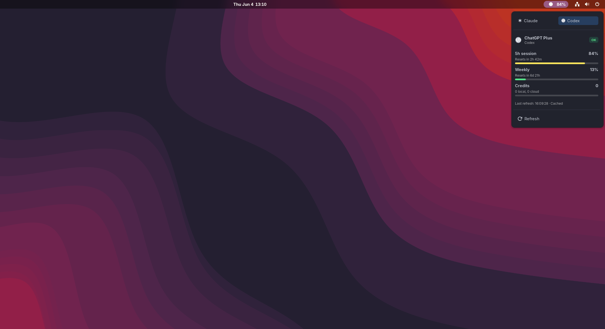

# GNOME AI UsageBar

GNOME AI UsageBar is a GNOME Shell extension that shows AI plan usage in the
top bar. It keeps Claude and OpenAI Codex/ChatGPT usage visible without opening
a terminal or browser.

The project is inspired by
[akitaonrails/ai-usagebar](https://github.com/akitaonrails/ai-usagebar), but
this implementation is a GNOME-native GJS extension. It does not require the
upstream Rust binary at runtime.

## ✨ At A Glance

- 🖥️ **GNOME Shell:** this repo currently supports GNOME Shell 45-50.
- 🤖 **Providers:** Claude and OpenAI Codex/ChatGPT.
- 🧭 **UI:** one compact panel indicator with provider tabs in the dropdown.
- 🔄 **Refresh:** manual refresh plus background refresh, defaulting to 300
  seconds.
- 💾 **Cache:** normalized local cache to reduce repeated vendor requests.
- 🔐 **Credentials:** vendor-managed OAuth files or GNOME Keyring. Secrets are not
  stored in GSettings, project files, logs, or shell environment variables.

GNOME Shell 40-44 support is planned and should remain separate from the
current GNOME Shell 45+ entry point.

## 🖼️ Screenshots





## ✅ What Works Today

- Top-bar indicator with the selected provider and current usage summary.
- Dropdown tabs for enabled Claude and Codex providers.
- Usage metrics for current and weekly usage windows when the vendor response
  provides them.
- Claude model-specific weekly windows, such as Sonnet, Opus, or Fable, when the
  usage API includes them.
- Manual refresh from the dropdown.
- Preferences button in the dropdown.
- Scheduled background refresh.
- Preferences for enabled providers, default provider, credential paths, proxy
  settings, refresh interval, dropdown opacity, theme colors, used/remaining
  metric, metric display style, panel icon style, and panel percentage/reset
  visibility.
- OAuth token refresh using vendor-managed credentials.
- GNOME Keyring/Secret Service fallback for OAuth documents.
- Owner-only permission checks for credential and cache files.
- Clear states for unauthenticated, rate-limited, offline, malformed response,
  cache error, and unsupported account cases.
- GJS tests for state, cache, credentials, parsing, and mocked refresh flows.

## 📋 Requirements

- GNOME Shell 45-50 for the current implementation.
- `gnome-extensions` for enabling, disabling, opening preferences, and packing
  the extension.
- `glib-compile-schemas` if you edit the schema or install from a source that
  does not include `schemas/gschemas.compiled`.
- For development checks: `make`, `gjs`, and `node`.

## 🛠️ Install For Local Development

Use a symlink when you are editing this checkout and want GNOME Shell to load
the working tree directly:

```sh
EXT_DIR="$HOME/.local/share/gnome-shell/extensions/ai-usagebar@miguins.com"
mkdir -p "$(dirname "$EXT_DIR")"
ln -s "$PWD" "$EXT_DIR"
gnome-extensions enable ai-usagebar@miguins.com
```

Open the preferences window:

```sh
gnome-extensions prefs ai-usagebar@miguins.com
```

The repository includes `schemas/gschemas.compiled`, so a fresh checkout does
not need a schema compilation step before enabling the extension. If you edit
the schema XML during development, regenerate the compiled schema:

```sh
glib-compile-schemas schemas
```

## 📥 Manual Install

A bundler is not required for a personal install. GNOME Shell can load an
unpacked extension directory from:

```text
~/.local/share/gnome-shell/extensions/ai-usagebar@miguins.com
```

The directory name must match the `uuid` in `metadata.json`.

From a cloned checkout or extracted source archive, copy the project into the
GNOME Shell extensions directory:

```sh
mkdir -p ~/.local/share/gnome-shell/extensions
cp -a "$PWD" ~/.local/share/gnome-shell/extensions/ai-usagebar@miguins.com
gnome-extensions enable ai-usagebar@miguins.com
```

If the copied source does not include `schemas/gschemas.compiled`, compile the
schema in the installed extension directory:

```sh
glib-compile-schemas \
  ~/.local/share/gnome-shell/extensions/ai-usagebar@miguins.com/schemas
```

When replacing an existing copy, disable the extension first, replace the
`ai-usagebar@miguins.com` directory with the new source, then enable it again.

## 🔄 Reload GNOME Shell

Reload GNOME Shell if the extension does not appear after enabling it or if
updated files are not picked up after replacing an existing install.

On Wayland, log out and log back in. On X11, press `Alt+F2`, enter `r`, and
press `Enter`.

## 🔐 Credentials And Privacy

The extension does not store API keys or OAuth tokens in GSettings, project
files, logs, or shell environment variables.

For the normal setup, sign in with the vendor CLI and leave the credential path
blank in AI UsageBar preferences:

- Claude: run `claude` and complete the sign-in flow.
- Codex: run `codex login` and complete the sign-in flow.

Credential lookup order:

1. A configured credential file path, when set in preferences.
2. The default vendor-managed OAuth file, when no custom path is set.
3. GNOME Keyring/Secret Service OAuth documents.

Default vendor-managed paths:

- Claude: `$CLAUDE_CONFIG_DIR/.credentials.json`, or
  `~/.claude/.credentials.json` when `CLAUDE_CONFIG_DIR` is not set.
- Codex: `$CODEX_HOME/auth.json`, or `~/.codex/auth.json` when `CODEX_HOME` is
  not set.

A custom credential path overrides the default vendor-managed path. When a
custom path is inside your home directory, the extension stores it in GSettings
as a home-relative `~/...` path instead of an absolute home path.

Credential files must be private enough for the extension to read them. The
credential file must be owner-only, and its directory must not be writable by
group or other users. For default paths, run the commands for the providers you
use:

```sh
chmod 600 ~/.claude/.credentials.json
chmod go-w ~/.claude

chmod 600 ~/.codex/auth.json
chmod go-w ~/.codex
```

Adjust the paths if you configured custom credential files.

Refreshed credential files are written through private temporary files and
atomically moved into place.

### 🗝️ GNOME Keyring

Secret Service entries should use this schema name:

```text
com.miguins.ai_usagebar.Credentials
```

Lookup attributes:

```text
application: ai-usagebar@miguins.com
vendor: anthropic | openai
kind: oauth-document
```

The item secret is the vendor OAuth document JSON. Treat it as sensitive.

Usage cache files are stored under the user cache directory and are also
owner-only. Unsafe cache permissions are treated as a cache error rather than
being read.

## ⚙️ Settings

The extension stores only non-sensitive preferences in GSettings.

| Key | Default | Purpose |
| --- | --- | --- |
| `selected-vendor` | `anthropic` | Provider shown by default when the extension starts. |
| `anthropic-enabled` | `true` | Whether Claude appears in the dropdown. |
| `anthropic-credentials-path` | empty | Optional Claude credentials file path. Empty uses the vendor-managed default path. |
| `openai-enabled` | `true` | Whether Codex appears in the dropdown. |
| `openai-codex-auth-path` | empty | Optional Codex auth file path. Empty uses the vendor-managed default path. |
| `refresh-interval-seconds` | `300` | Background refresh interval, from 60 to 3600 seconds. |
| `proxy-url` | empty | Optional HTTP proxy URL for vendor usage requests, for example `http://localhost:8080`. |
| `use-https-proxy-env` | `false` | Whether to use `HTTPS_PROXY` when `proxy-url` is empty. |
| `dropdown-opacity-percent` | `100` | Dropdown opacity, from 35 to 100 percent. |
| `follow-system-theme` | `false` | Whether badges, progress bars, and controls use GNOME Shell theme colors instead of built-in usage colors. |
| `display-metric` | `used` | Whether usage percentages show the consumed (`used`) or available (`remaining`) share of each window. |
| `metric-display-mode` | `both` | Whether dropdown usage windows render as `text`, a `bar`, or `both`. |
| `panel-icon-style` | `vendor` | Top-bar icon style: provider logo (`vendor`), a `generic` symbolic icon, or `hidden`. |
| `show-panel-percentage` | `true` | Whether the top-bar indicator shows the usage percentage text. |
| `show-panel-reset` | `true` | Whether the top-bar indicator appends the reset countdown after the percentage. |
| `color-panel-text-by-usage` | `true` | Whether top-bar text follows usage threshold colors, even when following the system theme. |
| `warning-threshold-enabled` | `true` | Whether the warning usage threshold is active. |
| `warning-threshold-percent` | `50` | Usage percentage for the warning threshold. |
| `alert-threshold-enabled` | `true` | Whether the alert usage threshold is active. |
| `alert-threshold-percent` | `80` | Usage percentage for the alert threshold. |
| `critical-threshold-enabled` | `true` | Whether the critical usage threshold is active. |
| `critical-threshold-percent` | `90` | Usage percentage for the critical threshold. |
| `critical-high-threshold-enabled` | `true` | Whether the additional critical reminder threshold is active. |
| `critical-high-threshold-percent` | `95` | Usage percentage for the additional critical reminder. |
| `exhausted-threshold-enabled` | `true` | Whether the exhausted usage threshold is active. |
| `exhausted-threshold-percent` | `100` | Usage percentage for the exhausted threshold. |

Thresholds trigger desktop notifications. Built-in progress bar colors use the
same thresholds when `follow-system-theme` is disabled. Top-bar text can still
follow those colors through `color-panel-text-by-usage`, even when the rest of
the extension follows the system theme.

Use **Reset Settings** at the bottom of the preferences window to restore these
preferences to their schema defaults. This does not delete vendor credentials or
GNOME Keyring entries.

## 🧪 Developer Workflow

Run the full local check before considering broad changes complete:

```sh
make check
```

`make check` runs these targets:

- `make syntax`: checks `extension.js` with `node --check`.
- `make schema`: validates the GSettings schema in strict dry-run mode.
- `make test`: runs the GJS test suite.
- `make pack`: creates a local extension zip.

You can also run the main checks directly:

```sh
gjs -m tests/run.js
glib-compile-schemas --strict --dry-run schemas
```

## 📦 Build A Bundle

This step is optional for local installs. Use it when you want a distributable
GNOME Shell extension zip:

```sh
make pack
```

The bundle is written to:

```text
/tmp/gnome-ai-usagebar-pack/ai-usagebar@miguins.com.shell-extension.zip
```

To use another output directory:

```sh
make pack PACK_DIR=/tmp/my-extension-pack
```

## 🗂️ Project Layout

- `extension.js`: GNOME Shell 45+ panel indicator and dropdown UI.
- `prefs.js`: preferences window.
- `stylesheet.css`: extension styling.
- `vendorUsage.js`: public vendor refresh dispatcher.
- `anthropicUsage.js` and `openAIUsage.js`: vendor-specific parsing and refresh
  flows.
- `vendorHttp.js`: Soup request handling and HTTP status mapping.
- `vendorCredentials.js`: credential source lookup, validation, and write-back.
- `credentialStore.js`: GNOME Keyring/Secret Service integration.
- `vendorErrors.js`: shared vendor error conversion.
- `vendorFormat.js`: shared usage metric formatting.
- `fileSecurity.js`: owner-only permission checks and private file writes.
- `cache.js`: normalized local usage cache.
- `usageState.js`: shared usage state model.
- `vendors.js`: vendor identifiers, settings keys, credential defaults, and CLI
  detection.
- `assets/`: provider icons.
- `schemas/`: GSettings schema.
- `tests/run.js`: GJS test runner.

## 🧯 Troubleshooting

| Problem | What to check |
| --- | --- |
| No provider tab appears | Enable at least one provider in the extension preferences. |
| Extension does not appear after enabling | Reload GNOME Shell, then confirm the install directory is named `ai-usagebar@miguins.com`. |
| Usage is unauthenticated | Sign in with the vendor CLI, configure a custom credential path, or add a GNOME Keyring OAuth credential. |
| Unsafe credential permissions | Make the credential file owner-only and ensure the parent directory is not writable by group or other users. |
| Usage stays cached | Press **Refresh** in the dropdown. The extension avoids unnecessary network requests while cached data is fresh. |
| Proxy is required | Set `proxy-url` in preferences, or enable `use-https-proxy-env` and provide `HTTPS_PROXY` through the GNOME Shell process environment. |

## 📄 License

MIT. See `LICENSE`.
